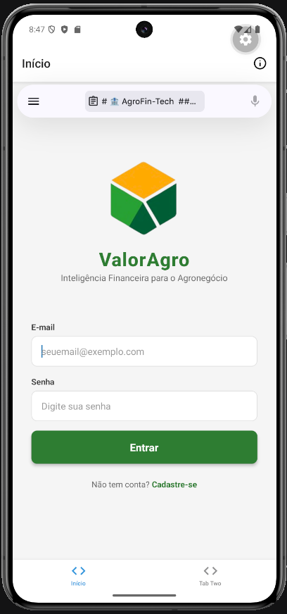

# 🌾 ValorAgro (AgroFin-Tech)

## 📄 PROPOSTA DE PROJETO

### 👥 Integrantes e Papéis:
* **Wellikson Wester Marinho das Chagas** — Líder Técnico e Desenvolvedor Back-end
* **Guilherme Soares Nistal Sanches** — Desenvolvedor Front-end
* **Miguel de Jesus Santa** — Analista de Negócios

### 🎯 Projeto Escolhido
**Projeto 5: App de Controle Financeiro Pessoal**

### 📸 Interface do Aplicativo (Aula 4)

### 📝 Descrição
O **ValorAgro** é um aplicativo de gestão financeira focado no setor de agronegócio, integrando funcionalidades de controle de despesas com análises de mercados de commodities.

### 🛠️ Tecnologias Utilizadas:
* **Linguagem:** TypeScript
* **Framework:** React Native com Expo
* **Navegação:** Expo Router
* **Estilização:** StyleSheet (Flexbox)
* **IDE:** Visual Studio Code

